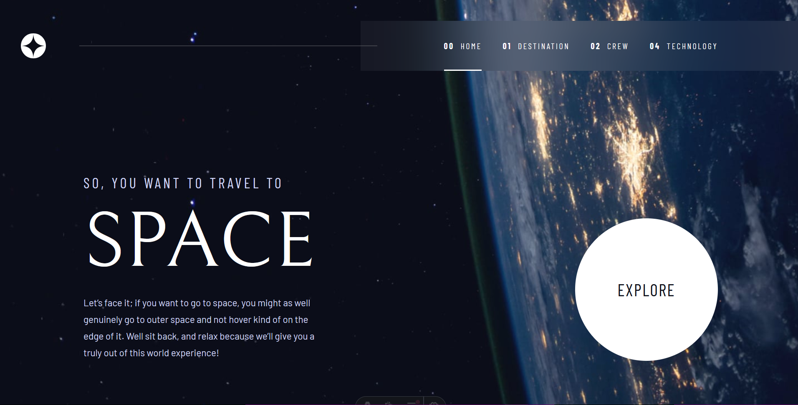

# Frontend Mentor - Space tourism website solution

This is a solution to the [Space tourism website challenge on Frontend Mentor](https://www.frontendmentor.io/challenges/space-tourism-multipage-website-gRWj1URZ3). Frontend Mentor challenges help you improve your coding skills by building realistic projects. 

## Table of contents

- [Frontend Mentor - Space tourism website solution](#frontend-mentor---space-tourism-website-solution)
  - [Table of contents](#table-of-contents)
  - [Overview](#overview)
    - [The challenge](#the-challenge)
    - [Screenshot](#screenshot)
    - [Links](#links)
  - [My process](#my-process)
    - [Built with](#built-with)
    - [What I learned](#what-i-learned)
    - [Useful resources](#useful-resources)
  - [Author](#author)
  - [Acknowledgments](#acknowledgments)


## Overview

### The challenge

Users should be able to:

- View the optimal layout for each of the website's pages depending on their device's screen size
- See hover states for all interactive elements on the page
- View each page and be able to toggle between the tabs to see new information

### Screenshot



### Links

- Solution URL: [Github](https://github.com/ChaudharyPradip/FrontendMentor_space_tourism_website)
- Live Site URL: [Space Tourism Website](https://fm-space-tourism-website-sol.netlify.app/)

## My process

### Built with

- [Astro](https://astro.build/) - JS library
- [Tailwind](https://tailwindcss.com/) - CSS framework
- JavaScript - Basic DOM manipulation
- Mobile-first workflow
- Semantic HTML5 markup
- Flexbox
- CSS custom properties

### What I learned

All the focusable elements should be wrapped with ```div```'s to add spacing etc. on sides otherwise directly applying those on these elements will mess up the focus states of the elements.

The code I'm proud of:-
This JavaScript code that I wrote which is used in almost all pages to quickly change the data being shown on the page.
```const options = document.querySelectorAll(".technology_options > span");
  const images = document.querySelectorAll("[data-image]");
  const dataItems = document.querySelectorAll("[data-item]");

  options.forEach((option) => {
    option.addEventListener("click", changeTechnology);
    option.addEventListener("keydown", (e) => {
      // @ts-ignore
      if (e.key == "Enter") {
        changeTechnology(e);
      }
    });
  });

  function changeTechnology(e: Event) {
    // @ts-ignore
    const selectedTechnology = e.target.getAttribute("data-option");

    options.forEach((option) => option.classList.remove("active_technology"));
    images.forEach((image) => image.classList.add("hidden"));
    dataItems.forEach((dataItem) => dataItem.classList.add("hidden"));

    document
      .querySelectorAll(`[data-image='${selectedTechnology}']`)
      .forEach((image) => image.classList.remove("hidden"));
    document
      .querySelector(`[data-item='${selectedTechnology}']`)
      ?.classList.remove("hidden");

    document
      .querySelector(`[data-option='${selectedTechnology}']`)
      ?.classList.add("active_technology");
  }
```

### Useful resources

- [Astro Docs](https://docs.astro.build/en/getting-started/) - These helped in understanding how Astro works and how to utilize full power of it.
- [Fontsource](https://fontsource.org/) - Fontsource provides easy way to self host fonts using npm which does all the heavy task under the hood during build time, all you need is to simply import the fonts in the project.
- [Tailwind CSS Docs](https://tailwindcss.com/docs/) - It is very helpful to quickly find out tailwind equivalents of CSS properties.

## Author

<!--- - Website - [Pradip Chaudhary](https://www.your-site.com) --->
- Frontend Mentor - [@ChaudharyPradip](https://www.frontendmentor.io/profile/ChaudharyPradip)
- Twitter - [@thePradiptalks](https://www.twitter.com/thePradiptalks)

## Acknowledgments

I would like to thank [Kevin Powell](https://www.youtube.com/@KevinPowell?themeRefresh=1) from whom I have learnt most of CSS which helps me to create such complex layouts with ease.